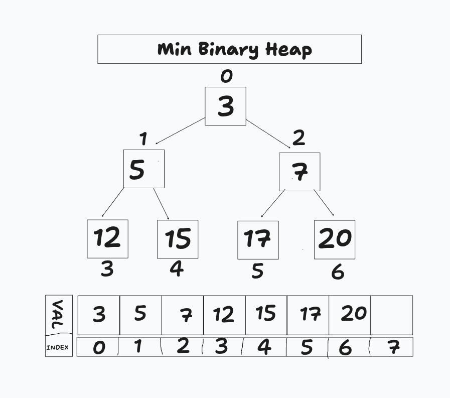
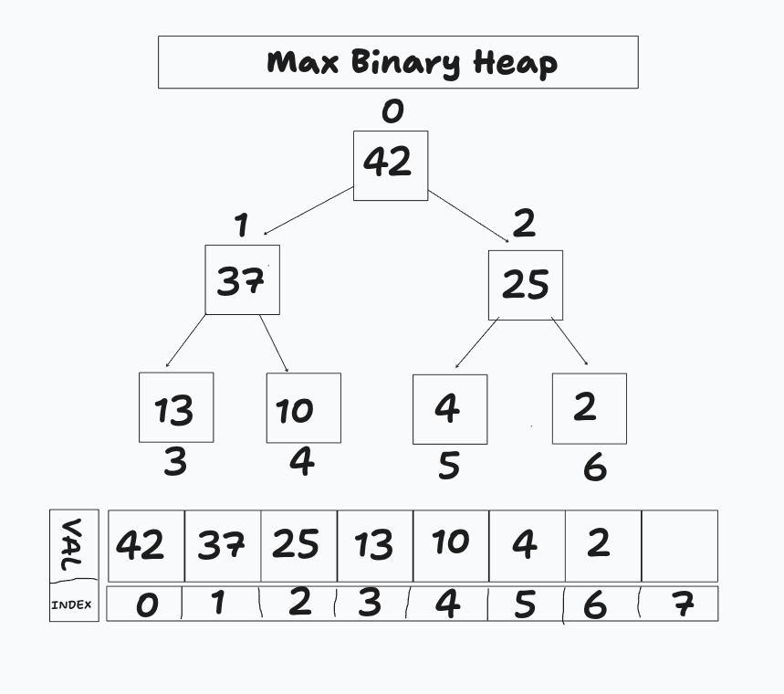

<h2 align="center">
    Binary HEAP
</h2>
<p align="center">
  <b>A Min Binary Heap is a complete binary tree where each parent node is less than or equal to its children.  
The smallest value is always at the root.

It can be efficiently represented using an array, where:
- Left child = 2i + 1
- Right child = 2i + 2
- Parent = (i - 1) // 2</b>
</p>

<p align="center">

</p>


<div align="center">


<hr>

<p align="center">
  <b>A Max Binary Heap is a complete binary tree where each parent node is greater than or equal to its children.  
The largest value is always at the root.

It can be represented using an array:
- Left child = 2i + 1
- Right child = 2i + 2
- Parent = (i - 1) // 2</b>
</p>
<p align="center">

</p>

# Scheduler Queue (Circular)

</div>

## Overview

This project implements a **circular scheduler queue** where each coder knows its position and its direct neighbors (left and right) using queue indices.

---

## Data Structure

Each coder contains:

* `id` : the unique identifier of the coder
* `index_in_queue` : the position of the coder in the queue
* `|| 1 1 / 0 0` : indicates the state of the dongle (active or inactive)
* `left_index` : the index of the previous coder in the circular queue
* `right_index` : the index of the next coder in the circular queue

---

## Example Output

```
id -> 2 index 0    || 1  1   left index 15, right index 1
id -> 3 index 1    || 1  1   left index 0, right index 4
id -> 5 index 2    || 1  1   left index 4, right index 6
id -> 7 index 3    || 1  1   left index 6, right index 8
id -> 4 index 4    || 1  1   left index 1, right index 2
id -> 11 index 5   || 1  1   left index 10, right index 12
id -> 6 index 6    || 1  1   left index 2, right index 3
id -> 15 index 7   || 1  1   left index 14, right index 16
id -> 8 index 8    || 1  1   left index 3, right index 9
id -> 9 index 9    || 1  1   left index 8, right index 10
id -> 10 index 10  || 1  1   left index 9, right index 5
id -> 0 index 11   || 0  0   left index 19, right index 15
id -> 12 index 12  || 1  1   left index 5, right index 13
id -> 13 index 13  || 1  1   left index 12, right index 14
id -> 14 index 14  || 1  1   left index 13, right index 7
id -> 1 index 15   || 0  1   left index 11, right index 0
id -> 16 index 16  || 1  1   left index 7, right index 17
id -> 17 index 17  || 1  1   left index 16, right index 18
id -> 18 index 18  || 1  1   left index 17, right index 19
id -> 19 index 19  || 1  0   left index 18, right index 11
```

---

```
[0] <-> [1] <-> [2] <-> ... <-> [19]
 ^                                   |
 |___________________________________|
```

---
<p align="center">
	<b>
	Resourcess
	</b>
</p>

<p align="center">
  <b>Become a Professional Linux System Programmer 🚀</b>
</p>

<p align="center">
   <b>THREADS — Chapter 29</b>
</p>

<p align="center">
  <a href="https://broman.dev/download/The%20Linux%20Programming%20Interface.pdf">
    
  </a>
</p>

<br>


<p align="center">
  <b>OPERATING SYSTEM CONCEPTS 🚀</b>
</p>

<p align="center">
  <a href="https://os.ecci.ucr.ac.cr/slides/Abraham-Silberschatz-Operating-System-Concepts-10th-2018.pdf">
    
  </a>
</p>
<p align="center">
  <b>The Fancy Algorithms That Make Your Computer Feel Smoother</b>
</p>
<p align="center">
  <a href="https://www.youtube.com/watch?v=O2tV9q6784k">
    
  </a>
</p>